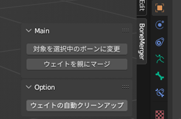

# Blender用 アドオン「BoneMerger」

BoneMerger アドオンは、Blenderにおいて自動ウェイト設定の作業時に使用した一時的なボーンを、親のボーンに統合するための便利なツールです。  
統合先の親ボーンが統合対象の場合でも、階層の深いボーンから順番に処理を行います。  
統合されて不要になった頂点グループやボーンの削除も自動的に行います。  

なお、本アドオンの作成・確認には Blender3.6.12 を利用しています。

## ダウンロード

Githubの[リリース](https://github.com/AoiKamishiro/BoneMerger/releases)から、最新のZipをダウンロードできます。  
BoneMerger_[バージョン番号].zip となっているファイルをダウンロードしてください。  

## インストール方法

1. Blenderを起動します。
2. メニューバーから「Edit」を選択し、「Preferences」をクリックします。
3. 「Add-ons」タブを選択します。
4. 「Install」ボタンをクリックし、ダウンロードした BoneMerger_[バージョン番号].zip ファイルを選択します。
5. BoneMerger アドオンを有効にします。

## 使い方

1. 自動ウェイト設定の作業中等で、一時的なボーンを作成している事を前提とします。
2. パネルから「BoneMerger」展開します。
3. ポーズモードかアーマチュアの編集モードに入り、親ボーンと統合したいボーンを選択します。
4. BoneMergerパネルの「対象を選択中のボーンに変更」をクリックします。下部の対象ボーンが置き換わります。
5. BoneMergerパネルの「ウェイトを親にマージ」をクリックします。
6. 完了です。

## オプション機能

オプション機能として、アーマチュア配下にある全メッシュに対してウェイトの正規化等を一括で行う機能もあります。

- ウェイトの合計制限 (Limit=4)
- ウェイトの正規化
- ウェイトの量子化 (Steps=128)
- ウェイトのクリーンアップ (limit=0.0001)

上記の作業を、使用部分(Subset) を ALL にした状態で実行します。

また、対応するボーンの存在しない頂点グループを削除する機能もあります。

## 注意

事前に各頂点に対してウェイトとして寄与するボーンが4つ以下になるようにしておく事をおすすめします。(上記のオプション機能を利用する事でも可能です。)  
5つ以上ある場合、Unityでは5つめ以降のウェイトは無視される仕様により、頂点の統合前後で挙動に差異が生じる可能性があります。  

## サポート

BoneMerger アドオンに関する質問や問題がある場合は、以下の連絡先までお願いします。

[X](https://x.com/aoi3192)
