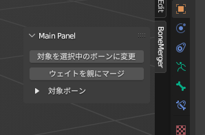

# BoneMerger アドオン

BoneMerger アドオンは、Blenderにおいて自動ウェイト設定の作業時に使用した一時的なボーンを、親のボーンに統合するための便利なツールです。
統合先の親ボーンが統合対象の場合でも、階層の深いボーンから順番に処理を行うため、簡単に扱えます。
統合されて不要になった頂点グループやボーンの削除も自動的に行います。

## インストール方法

1. Blenderを起動します。
2. メニューバーから「Edit」を選択し、「Preferences」をクリックします。
3. 「Add-ons」タブを選択します。
4. 「Install」ボタンをクリックし、BoneMerger.zip ファイルを選択します。
5. BoneMerger アドオンが有効になっていることを確認します。

## 使い方

1. 自動ウェイト設定の作業中に、一時的なボーンを作成している事を前提とします。
2. パネルから「BoneMerger」展開します。
3. ポーズモードかアーマチュアの編集モードに入り、親ボーンと統合したいボーンを選択します。
4. BoneMergerパネルの「対象を選択中のボーンに変更」をクリックします。下部の対象ボーンが置き換わります。
5. BoneMergerパネルの「ウェイトを親にマージ」をクリックします。
6. 完了です。

## 注意

事前に各頂点に対してウェイトとして寄与するボーンが4つ以下になるようにしておく事をおすすめします。
5つ以上ある場合、Unityでは5つめ以降のウェイトは無視される仕様により、頂点の統合前後で挙動に差異が生じる可能性があります。

## サポート

BoneMerger アドオンに関する質問や問題がある場合は、以下の連絡先までお願いします。

[サポートフォーラム](https://example.com/support)
